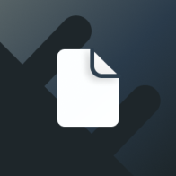

<div align="center">
  <a href="https://github.com/ionic-team/cordova-outsystems-file">
    
  </a>

<h3 align="center"> cordova-outsystems-file</h3>

  <p align="center">
    OutSystems' Cordova Plugin for Geolocation.
    <br />
    <a href="https://github.com/ionic-team/repo_name">🔌 Capacitor Plugin</a>
    ·
    <a href="https://github.com/ionic-team/cordova-outsystems-file">🤖 Android Library</a>
    ·
    <a href="https://github.com/github_username/repo_name">🍏 iOS Library</a>
  </p>
  <p align="center">
    <a href="https://github.com/ionic-team/cordova-outsystems-file/issues/new?labels=bug&template=bug-report.md">🐛 Report Bug</a>
    ·
    <a href="https://github.com/ionic-team/cordova-outsystems-file/issues/new?labels=enhancement&template=feature-request.md">   💡 Request Feature</a>
  </p>
</div>

*This plugin is SUPPORTED by OutSystems. Customers entitled to Support Services may obtain assistance through Support.*

## Installation

```console
cordova plugin add <path-to-repo-local-clone>
```

## API

<docgen-index>

</docgen-index>